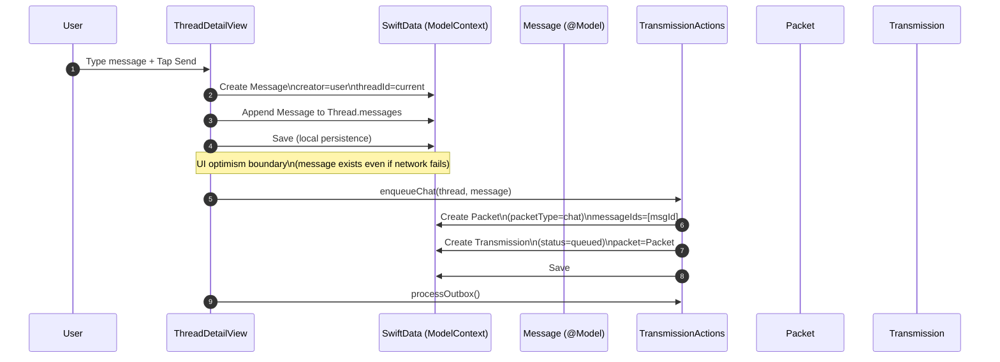

# Capture Flow (SolMobile) — v0.1

**Purpose:** Document the user capture path from typing a message through local persistence and enqueueing a `Transmission`, establishing the UI optimism boundary before any network work occurs.

## Mermaid (Sequence) — user input → local save → enqueue



## Mermaid (Flowchart) — capture state progression

```mermaid
flowchart TD
  A[User types message] --> B[Tap Send]
  B --> C[Create Message (SwiftData)]
  C --> D[Append to Thread]
  D --> E[Save local state]
  E --> F[enqueueChat()]
  F --> G[Create Packet]
  G --> H[Create Transmission(status=queued)]
  H --> I[processOutbox()]
```