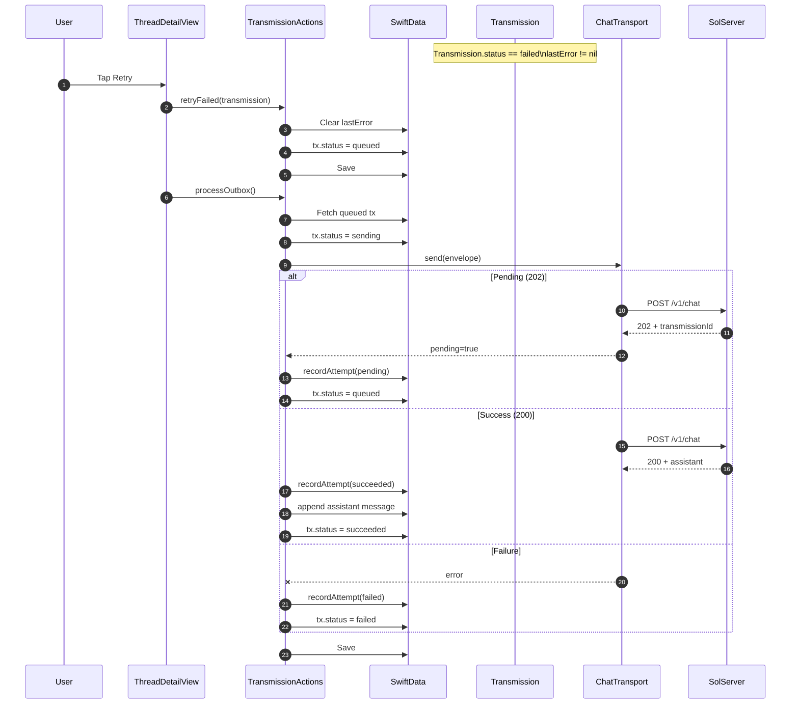
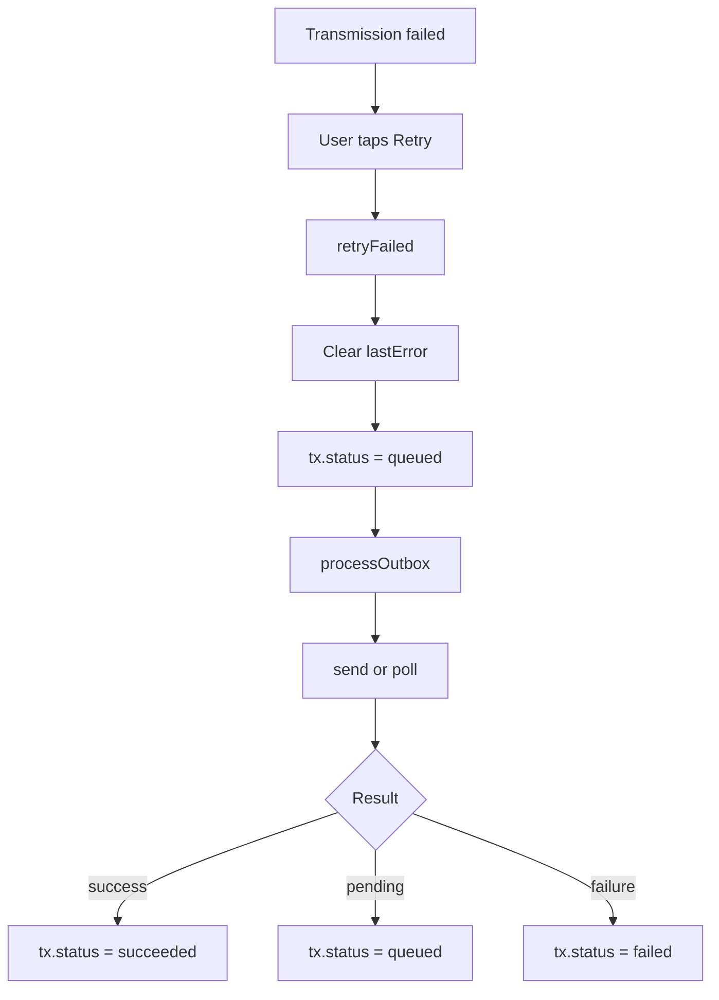

# Retry Flow (SolMobile) — v0.1

**Purpose:** Document the user-driven retry path for a failed `Transmission` so UI, outbox processing, and server outcomes are captured in a drift-resistant way.

## Mermaid (Sequence) — failed → retry → queued → send → pending/success/failure

## Mermaid (Flowchart) — status transitions

