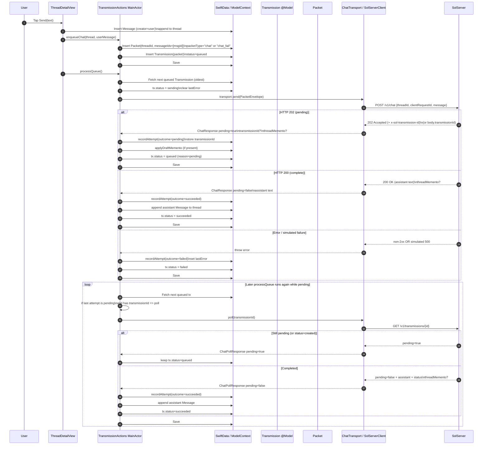

# Transmission / Outbox Flow (SolMobile) — v0.1

**Purpose:** Capture the *current truth* of the Transmission (outbox) pipeline so we can reason about reliability, pending (202) polling, UI banners, and where SolM gates can hook in later.

## Source of truth (explicit)
These four files are the authoritative inputs for this doc:

- `Connectivity/SolServerClient.swift`
- `Views/Chat/ThreadDetailView.swift`
- `Actions/TransmissionAction.swift`
- `Models/Transmission.swift`

(Provided as raw GitHub URLs in the thread; treat those exact refs as canonical.)

---

## Key objects (as implemented)

### `Transmission` model
- `TransmissionStatus`: `queued | sending | succeeded | failed`
- `Transmission` persists:
  - `statusRaw` + computed `status`
  - `createdAt`, `lastError`
  - `deliveryAttempts` ledger (cascade)
  - `packet` (SwiftData relationship)
  - draft ThreadMemento fields: `serverThreadMementoId`, `serverThreadMementoCreatedAtISO`, `serverThreadMementoSummary`

### Transport interfaces (outbox contracts)
- `ChatTransport.send(envelope:) -> ChatResponse`
- Optional capability: `ChatTransportPolling.poll(transmissionId:) -> ChatPollResponse`
- `SolServerClient` implements both.

### ThreadDetailView responsibility (UI)
- Inserts user `Message`
- Calls `TransmissionActions.enqueueChat(...)`
- Calls `processOutbox()` on appear, after sending, and after Retry
- Shows Outbox banner derived from local `Transmission` state (queued/sending/failed)

---

## Pending delivery (202) + polling semantics (as implemented)

### Send endpoint
- `POST /v1/chat`
- For pending behavior:
  - server returns **HTTP 202**
  - client decodes response (best-effort)
  - transmission id is read from header `x-sol-transmission-id` or body `transmissionId`

### Poll endpoint
- `GET /v1/transmissions/{id}`
- `pending` computed as:
  - `decoded.pending ?? (decoded.transmission.status == "created")`

---

## Mermaid (Sequence) — tap Send → enqueue → send/pending → poll → UI updates



---

## Mermaid (Flowchart) — state machine view

```mermaid
flowchart TD
  A[ThreadDetailView send text] --> B[TransmissionActions enqueueChat]
  B --> C[Create Packet + Transmission status=queued]
  C --> D[TransmissionActions processQueue]
  D --> E fetchNextQueuedSelection?
  E -- none --> Z[Exit: nothing queued]
  E -- tx --> F[tx.status = sending]

  F --> G handlePendingPollIfNeeded?
  last attempt pending + transmissionId
  G -- yes --> H[transport.poll transmissionId
  GET /v1/transmissions/id]
  H --> I pending?
  I -- yes --> C2[tx.status = queued
  (wait; retry later)]
  I -- no --> J[append assistant message
   tx.status = succeeded]

  G -- no --> K terminal conditions?
  maxAttempts / pending TTL
  K -- yes --> L[tx.status = failed]
  K -- no --> M respect backoff?
  M -- yes --> C2
  M -- no --> N[transport.send(envelope)
  POST /v1/chat]

  N --> O response.pending OR HTTP 202?
  O -- yes --> P[record attempt=pending
  store transmissionId
  apply draft memento
   tx.status=queued]
  O -- no --> Q HTTP 200?
  Q -- yes --> R[record attempt=succeeded
  append assistant msg
   tx.status=succeeded]
  Q -- no --> S[record attempt=failed
   tx.status=failed]
```

---

## Observability hooks (already present)

- `TransmissionActions` logs:
  - enqueue, selection, backoff decisions, send timing, terminal conditions
- `ThreadDetailView` logs retry taps and summary changes
- `SolServerClient` persists last chat status code + timestamp to UserDefaults (`sol.dev.*`)

---

## Assumptions (explicit)
These are *inferred* from the current code patterns and naming; validate before locking:

1. `processOutbox()` in `ThreadDetailView` likely coalesces runs (`isProcessingOutbox` + `outboxNeedsRerun`) and calls `TransmissionActions.processQueue()` (async).
2. `handlePendingPollIfNeeded`, `retryFailed`, and the rest of `TransmissionActions` helpers exist and behave as named (only partially visible in fetched snippet).
3. `Packet` and `DeliveryAttempt` models exist with fields implied by usage (`messageIds`, `outcome`, `transmissionId`, etc.).

---

## Next (when you’re ready)
- Convert this into a repo-native doc under `docs/` and link it from the relevant ADR.
- Add a *machine-readable* Enrichment Lattice table and IntentGate contract (separate docs) and decide where in this flow the gates run (likely before `enqueueChat` or before `sendOnce`).
